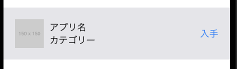
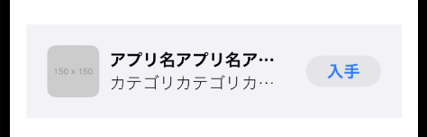

# 練習課題 01

## 手本



## 基本課題

```
AppStoreのアプリ１行の形にレイアウトすること
```

Practice01.swift をベースに以下の４つの View をレイアウトしてください。

- 画像(1)
- タイトル(2)
- 説明テキスト(3)
- ボタン(4)

```swift
struct Practice01: View {
    var body: some View {

		//画像(1)
		AsyncImage(url: URL(string: "https://placehold.jp/150x150.png")) { image in
			image.image?.resizable()
		}

		//タイトル(2)
		Text("LINE：ディズニーツムツム")

		//詳細テキスト(3)
		Text("パズル")

		//ボタン(4)
		Button(action: {

		}, label: {
			Text("入手")
		})
    }
}
```

- 回答例：Practice01Answer.swift

## 応用課題

```
作ったサンプルをさらに本物に近づけてテキストの色や大きさ、角丸などを組み込む
```

- 応用例：Pracice01Advanced.swift



## 参考 URL

画像を角丸にする
https://yotubarail.work/entry/swiftuiclipshape

ボタンの作り方
https://www.yururiwork.net/archives/1200
