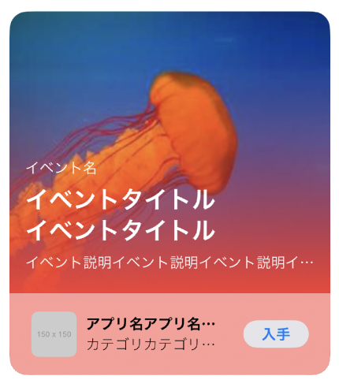
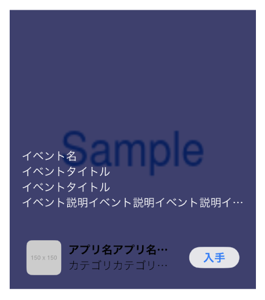

# 練習課題 02

## 作成例



## 基本課題

```
AppStoreのカードのデザイン
```

Practice02.swift をベースに以下の 5 つの View をカード上にレイアウトしてください。カード全体の高さは固定で 400 を指定してください。

- 画像(1)
- イベント名(2)
- イベントタイトル(3)
- イベント説明(4)
- フッター要素(5)

※ フッター要素は練習課題 01 で作った 1 行のコンポーネントをそのまま使っています

```swift
struct Practice02: View {
	var body: some View {

		//画像(1)
		AsyncImage(url: URL(string: "https://picsum.photos/300/300")) { image in
			image.image?.resizable()
		}

		//イベント名(2)
        Text("イベント名")

		//イベントタイトル(3)
		Text("イベントタイトル\nイベントタイトル")

		//イベント説明(4)
		Text("イベント説明イベント説明イベント説明イベント説明")

		//フッター要素(5)
		HStack(spacing: 10) {
			...(略)
		}
		.padding(10)
	}
}
```

### 必要な知識

- 背景画像と上の要素が重なっている => ``ZStack``
- コンテンツを下に配置 => ``VStack + Spacer``

- 回答例：Practice02Answer.swift

#### 作成例



## 応用課題

```
作ったサンプルをさらに本物に近づけてテキストの色や大きさ、角丸などを組み込む
ZStack でグラデーションの背景を重ねる

グラデーションは以下のコードを利用してください
let gradient = Gradient(stops: [.init(color: Color.clear, location: 0.0), .init(color: Color.red, location: 0.5)])
```

- 応用例：Practice02Advanced.swift

## 参考 URL


画像を角丸にボーダーをつける
https://qiita.com/yuta-shoji/items/3287f937ce23df7b6968

グラデーションの背景
https://note.com/resan0725/n/n7d5d56d30bfb

